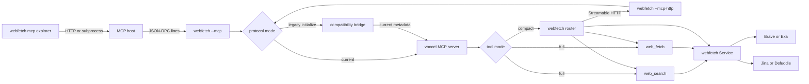

# MCP integration

Start the MCP server over stdio. It speaks the current stateless protocol and
also bridges the legacy initialize flow used by clients such as Jcode. The
default preserves the full two-tool compatibility surface:

```bash
go install ./cmd/webfetch
webfetch --mcp
```

Use the compact surface when the host should receive one tool definition:

```bash
webfetch --mcp --compact
# Equivalent shorthand:
webfetch --mcp-compact
```

Configure an MCP host to launch the same command:

```json
{
  "mcpServers": {
    "webfetch": {
      "command": "webfetch",
      "args": ["--mcp", "--compact"],
      "env": {
        "BRAVE_API_KEY": "...",
        "EXA_API_KEY": "...",
        "JINA_API_KEY": "..."
      }
    }
  }
}
```

If a host accepts only an executable path and cannot supply arguments, it may
launch `webfetch` directly. On piped stdin with no arguments, `webfetch`
distinguishes an MCP JSON-RPC request from its one-shot JSON protocol and starts
the full MCP surface automatically. `WEBFETCH_MCP_TOOL_MODE=compact` still
selects the compact surface in this mode.

For example, Apfel accepts an MCP executable path directly:

```bash
apfel --mcp /absolute/path/to/webfetch "summarize https://example.com"
```

`webfetch --mcp` reads newline-delimited JSON-RPC messages from stdin and writes
only MCP messages to stdout. It exposes `web_search` and `web_fetch`. The
`--compact` mode exposes one `webfetch` router tool instead.

The full mode remains the default so existing MCP clients do not break. Set
`WEBFETCH_MCP_TOOL_MODE=compact` when the host configuration cannot add the
`--compact` argument.

## Streamable HTTP mode

Start the current protocol over one stateless HTTP endpoint:

```bash
webfetch --mcp-http
webfetch --mcp-http --compact --listen 127.0.0.1:8788
```

The default listener is `127.0.0.1:8787`. A non-loopback listener requires
`WEBFETCH_MCP_BEARER_TOKEN`:

```bash
WEBFETCH_MCP_BEARER_TOKEN='change-me' \
  webfetch --mcp-http --listen 0.0.0.0:8787
```

Repeat `--allow-origin` to allow browser origins. The SDK validates the current
`Mcp-Protocol-Version`, `Mcp-Method`, and `Mcp-Name` headers. HTTP mode does not
translate the legacy `initialize` handshake. Keep using stdio for clients that
require the `2024-11-05` compatibility bridge.

The HTTP endpoint has no MCP session state. It accepts one current-protocol POST
per request and shuts down with the parent process context.

## MCP explorer

The binary includes a small inspection client:

```bash
webfetch mcp list http://127.0.0.1:8787
webfetch mcp inspect http://127.0.0.1:8787 web_fetch
webfetch mcp call http://127.0.0.1:8787 web_fetch \
  -a url https://example.com -a format headings -a max_lines 20
webfetch mcp list --command webfetch --arg --mcp --arg --compact
webfetch mcp inspect --command webfetch --arg --mcp web_fetch
webfetch mcp call --command webfetch --arg --mcp web_fetch \
  -a url http://127.0.0.1:1/blocked
```

HTTP explorer calls use `WEBFETCH_MCP_BEARER_TOKEN` or an explicit `--token`.
Subprocess mode passes explicit `--arg` values without a shell. Call arguments
can use repeatable `-a` or `--argument` pairs. Values that are valid JSON are
decoded as numbers, booleans, arrays, objects, or null; other values remain
strings. `--args` remains available for a complete JSON object, and later
argument pairs override matching keys. Successful commands write JSON to
stdout. Validation and transport errors exit nonzero, while tool failures are
reported as JSON with `isError: true`.

Set `WEBFETCH_MCP_LOG_LEVEL=error|info|debug` for opt-in structured stderr
diagnostics. The default is `off`, and stdio stdout remains protocol-only.

## Context-efficient compact mode

MCP 2026-07-28 and SEP-2106 improve schema efficiency. They do not hide tools
from the model or provide server-side semantic routing. Webfetch addresses the
server-side exposure problem with an explicit compatibility-preserving compact
mode:

- Full mode advertises two focused tools: `web_fetch` and `web_search`.
- Compact mode advertises one `webfetch` tool with an explicit `operation` of
  `fetch` or `search` and a nested operation-specific `input` object.
- The compact input and output schemas use JSON Schema 2020-12 `oneOf`, `$defs`,
  and `$ref` so the operation branches and result models are contained under
  one tool definition.
- Compact mode is deterministic. It does not call an LLM, perform semantic
  intent classification, or claim to make arbitrary future tools disappear.
- Agent-side semantic routing remains a host/orchestrator responsibility. If
  the server grows beyond these operations, add explicit compact branches or
  use a client-side routing layer rather than silently changing the full mode.

Compact call shapes:

```json
{"operation":"fetch","input":{"url":"https://example.com"}}
{"operation":"search","input":{"query":"golang error handling","max_results":5}}
```

## Version and terminology

This repository uses **MCP 2.0** as shorthand for the current stateless MCP
revision, whose protocol version is the date string `2026-07-28`. Upstream
specification documents identify the revision by that date rather than by an
official “2.0” package name.

The server uses the current-only Go SDK internally:

```text
github.com/voocel/mcp-sdk-go v1.3.0
```

That SDK implements `2026-07-28` exclusively. The stdio adapter around it
accepts the older `initialize` handshake as a compatibility layer, answers the
legacy handshake as `2024-11-05`, and adds current per-request metadata before
forwarding `tools/list` and `tools/call` to the SDK server. Current clients
continue to use `server/discover` and the strict current metadata contract.

## Current protocol contract

The `2026-07-28` revision changes MCP from a connection-oriented handshake to a
stateless request model:

- Each request carries its protocol context in `params._meta`.
- Current requests include these reserved metadata keys:
  - `io.modelcontextprotocol/protocolVersion`
  - `io.modelcontextprotocol/clientInfo`
  - `io.modelcontextprotocol/clientCapabilities`
- `server/discover` replaces the old initialization exchange for discovering
  supported versions, server capabilities, and instructions.
- `tools/list` lists the available tools.
- `tools/call` invokes a tool.
- Results include `resultType`, normally `complete` for webfetch responses.
- The current protocol-level `initialize`/`notifications/initialized` exchange
  and `Mcp-Session-Id` are not part of the current server contract. Legacy
  clients may use that exchange through the stdio compatibility bridge; the
  bridge does not create or persist an MCP session.
- Stdio uses one JSON-RPC message per line. A client must keep stdin open while
  it exchanges requests and responses, then close it for a clean server exit.
  Process cancellation is independent of stdin ownership: `SIGINT` and
  `SIGTERM` stop the server promptly even when the parent keeps stdin open.

A minimal discovery request looks like this:

```json
{
  "jsonrpc": "2.0",
  "id": 1,
  "method": "server/discover",
  "params": {
    "_meta": {
      "io.modelcontextprotocol/protocolVersion": "2026-07-28",
      "io.modelcontextprotocol/clientInfo": {
        "name": "example-client",
        "version": "1.0.0"
      },
      "io.modelcontextprotocol/clientCapabilities": {}
    }
  }
}
```

A legacy client that sends `initialize` without current `_meta` fields receives
the `2024-11-05` compatibility handshake. Its later `tools/list` and
`tools/call` requests are translated to current requests internally. A request
that omits `_meta` before a legacy handshake remains a protocol error.

## What changed in 2026-07-28

The release is broader than the webfetch MCP surface implemented here. The main
protocol and ecosystem changes are:

- **Stateless core:** protocol sessions and the initialization handshake are
  removed. Applications can still carry state explicitly in ordinary tool
  arguments, such as a browser or basket handle.
- **Multi-round-trip requests (MRTR):** server-to-client interactions such as
  elicitation return an `input_required` result and are retried with
  `inputResponses` and `requestState`, rather than opening an unrelated server
  request. Webfetch's current tools do not use MRTR.
- **Routable and cacheable traffic:** Streamable HTTP uses `Mcp-Method`,
  `Mcp-Name`, and related headers. List and resource results can advertise
  `ttlMs` and `cacheScope`, and W3C trace context keys are carried in `_meta`.
  Webfetch HTTP mode exposes the current transport and advertises a one-minute
  public cache policy for deterministic discovery and tool lists.
- **First-class extensions:** extensions use reverse-DNS identifiers and can
  evolve independently. Tasks and MCP Apps are official extensions in this
  revision. The selected SDK includes Tasks support, but webfetch does not
  register Tasks or MCP Apps yet.
- **Authorization hardening:** the OAuth and OpenID Connect guidance adds issuer
  validation, clearer dynamic-client registration, resource migration, refresh
  token, and scope-accumulation rules. The local stdio server uses provider API
  keys from its environment and does not implement an OAuth authorization flow.
- **Feature lifecycle:** Roots, Sampling, and Logging are deprecated upstream,
  with a compatibility window. The selected current-only SDK intentionally
  omits those older/deprecated surfaces. The legacy bridge is limited to the
  initialize, tools/list, and tools/call flow required by existing hosts.
- **Full JSON Schema:** tool input and output schemas use JSON Schema 2020-12.
  Input schemas still require an object root, while structured output may be any
  JSON value. Webfetch declares explicit input and output schemas for both
  registered tools. Compact mode additionally uses `oneOf`, `$defs`, and `$ref`
  within its single router schema.

## Architecture



The CLI creates a configured `webfetch.Service`, registers either the full tools
or the compact router with the SDK server, and selects stdio or Streamable HTTP
as the transport. Current requests pass through unchanged on both transports;
legacy requests are normalized only by the stdio bridge. All handlers reuse the
same provider, reader, HTTP safety, and error paths as the normal CLI.

## Tools

### Compact `webfetch`

The compact tool is available with `--mcp --compact` or
`WEBFETCH_MCP_TOOL_MODE=compact`. It has one input schema with two explicit
branches:

| Field | Type | Required | Meaning |
| --- | --- | --- | --- |
| `operation` | const string | yes | `fetch` or `search` |
| `input` | object | yes | The matching `web_fetch` or `web_search` arguments |

The structured result has this shape:

```json
{
  "operation": "fetch",
  "result": {
    "url": "https://example.com",
    "status_code": 200,
    "content": "# Example"
  }
}
```

Search uses the analogous `{"operation":"search","result":{...}}` shape.
The compact router is a context-size optimization, not a replacement for
client-side semantic tool selection.

### `web_search`

Searches the configured public-web provider and returns normalized results.

Input schema:

| Field | Type | Required | Default or limits |
| --- | --- | --- | --- |
| `query` | string | yes | Must not be empty |
| `max_results` | integer | no | `10`, range `1` to `50` |
| `category` | string | no | Provider-specific category, such as `news` |
| `include_domains` | array of strings | no | At most `50` hostnames |
| `start_published_date` | string | no | RFC3339 or `YYYY-MM-DD` |
| `include_highlights` | boolean | no | `true` |
| `highlight_sentences` | integer | no | `3`, range `1` to `10` |

The result has this shape:

```json
{
  "query": "golang error handling",
  "provider": "brave",
  "results": [
    {
      "title": "Example result",
      "url": "https://example.com/article",
      "description": "A normalized description.",
      "published_at": "2026-08-01T00:00:00Z",
      "highlights": ["A provider-generated highlight."]
    }
  ]
}
```

The MCP search provider is selected when the server starts. Brave is used by
default. Brave translates `include_domains` into `site:` query clauses, while
`category` and `start_published_date` require Exa. Set
`WEBFETCH_SEARCH_PROVIDER=exa` to use Exa instead.

### `web_fetch`

Fetches a URL as clean Markdown or returns the bounded raw response body.

Input schema:

| Field | Type | Required | Default or limits |
| --- | --- | --- | --- |
| `url` | string | yes | Absolute `http` or `https` URL |
| `raw` | boolean | no | `false` |
| `reader` | string | no | `jina`, `defuddle`, or `auto`; omitted uses Jina |
| `render` | string | no | `never`, `auto`, or `always`; default `never` |
| `render_wait` | string | no | `load` or `networkidle`; only valid when render is enabled |
| `format` | string | no | `markdown`, `headings`, or `links`; omitted preserves full content |
| `start_line` | integer | no | Zero-based offset in the selected projection; default `0` |
| `max_bytes` | integer | no | `0`, output limit in UTF-8 bytes |
| `max_lines` | integer | no | `0`, output limit in lines |

The normalized result includes the requested and final URLs, HTTP status,
content type, title, description, domain, favicon, image, language, publication
date, author, site, word count, extractor, source, and content. Raw responses
set `source` to `raw` and preserve the bounded response body in `content`.
`headings` returns Markdown heading lines in source order. `links` returns
deduplicated link targets in first-seen order. `start_line` selects a later
line range without server-side state. When more derived lines remain, the
response includes `next_start_line`.
When an output limit is reached, the result also includes `truncated`,
`truncated_by`, total/output byte and line counts, and the selected limits.
`raw: true` is valid only with the default `markdown` format. Existing calls
that omit the new fields retain the unlimited full-content behavior.

When `render` is `auto` or `always`, the selected reader must be `defuddle` or
`auto`; rendered HTML is parsed locally and is never sent through the Jina
reader. `auto` statically fetches and classifies the page first, escalating
likely JavaScript shells to Chrome or Chromium. If the browser fails but the
static HTML is extractable, the result remains usable and includes a `warnings`
array. `always` returns a browser/render error instead of silently falling back
for an explicit Defuddle request.

Rendered results add `rendered: true` and may add `warnings`. Human CLI output
remains content-only Markdown, and omitted render fields preserve the previous
static behavior.

## Provider configuration

The MCP process receives the same environment variables as the CLI:

| Variable | Type | Default | Use |
| --- | --- | --- | --- |
| `JINA_API_KEY` | string | empty | Optional Jina Reader credential |
| `BRAVE_API_KEY` | string | empty | Required when Brave search is used |
| `EXA_API_KEY` | string | empty | Required when Exa search is selected |
| `WEBFETCH_SEARCH_PROVIDER` | `brave` or `exa` | `brave` | Selects the search provider |
| `WEBFETCH_MCP_TOOL_MODE` | `full` or `compact` | `full` | Selects the MCP tool surface |
| `WEBFETCH_MCP_BEARER_TOKEN` | string | empty | Protects non-loopback HTTP mode and explorer calls |
| `WEBFETCH_MCP_LOG_LEVEL` | `off`, `error`, `info`, or `debug` | `off` | Enables stderr request diagnostics |
| `WEBFETCH_RENDER_TIMEOUT` | Go duration | `30s` | Per-render timeout |
| `WEBFETCH_RENDER_MAX_CONCURRENCY` | positive integer | `2` | Maximum concurrent browser renders |
| `WEBFETCH_RENDER_MAX_REQUESTS` | positive integer | `100` | Maximum browser requests per render |
| `WEBFETCH_RENDER_MAX_NETWORK_BYTES` | positive integer | `33554432` | Aggregate proxied network byte budget per render |
| `WEBFETCH_RENDER_MAX_HTML_BYTES` | positive integer | `8388608` | Maximum returned DOM HTML bytes |
| `WEBFETCH_CHROME_PATH` | executable path | auto-discover | Chrome or Chromium executable |

Provider endpoints and HTTP limits are configured in the Go service rather than
as MCP tool arguments. The MCP client should pass search filters and reader
selection through tool arguments, not environment variables.

## Safety and request behavior

MCP calls inherit the normal webfetch HTTP policy:

- Only absolute `http` and `https` URLs are accepted.
- URLs with embedded username or password credentials are rejected.
- Loopback, private, link-local, multicast, unspecified, and other private
  network targets are rejected by default.
- Redirect targets are validated with the same network policy.
- Requests default to a 30-second timeout.
- HTTP mode defaults to loopback `127.0.0.1:8787`; non-loopback binds require
  `WEBFETCH_MCP_BEARER_TOKEN`.
- Response bodies are bounded to 8 MiB by default. Output limits only project
  the fetched result and do not increase that network safety cap.
- Browser rendering is opt-in, uses a loopback-only proxy backed by the same
  URL validation and vetted dialer, disables QUIC, and applies per-render
  request, network-byte, HTML-byte, timeout, and concurrency budgets. Render
  budgets are server configuration, not caller-controlled MCP arguments.
- `browser_unavailable`, `render_failed`, and `render_budget_exceeded` are
  stable render failure codes. `render=auto` may return a static result with a
  warning when the browser path is unavailable; `render=always` is strict.
- Transient failures and throttling are retried up to three attempts.
- Search and fetch errors are returned as MCP tool results with `isError: true`
  when the tool itself could not complete. Malformed JSON-RPC requests remain
  protocol errors.

The private-network exception exists in the internal service configuration for
trusted testing, but the MCP CLI does not enable it by default.

## Scope boundaries

The current webfetch MCP server intentionally provides a small tool surface:

- Full mode exposes `web_search` and `web_fetch`; compact mode exposes one
  `webfetch` router tool.
- Current clients may use stdio or Streamable HTTP. The HTTP mode is current
  protocol only, while stdio retains the narrow legacy bridge.
- It does not register the SDK's Tasks extension or expose long-running task
  handles.
- It does not provide MCP Apps or server-rendered UI resources.
- It does not implement other legacy protocol versions or session negotiation;
  the required `2024-11-05` initialize/tools bridge for existing Jcode clients
  is intentionally supported as a narrow compatibility boundary.
- The separate one-shot `--protocol` JSON search envelope is not MCP. It uses
  `{ "tool": "web_search", "args": {...} }` and is retained for existing
  command-line integrations.

The SDK has support for broader current-protocol mechanisms, but a capability
is not part of webfetch's public MCP surface until this binary registers and
tests it.

## Development and verification

The executable installed-binary smoke-test contract is in
[mcp-smoke-test.md](mcp-smoke-test.md). It defines the wire fixtures, black-box
cases, fake-provider integration cases, and repository gates used below.

Run the repository checks after changing the MCP adapter or its SDK dependency:

```bash
gofmt -w cmd/webfetch/*.go
go mod tidy
go build ./...
go test ./... -count=1
go test -race ./...
go vet ./...
go mod verify
just test
just build
git diff --check

BIN_DIR="$(go env GOBIN)"
if [ -z "$BIN_DIR" ]; then BIN_DIR="$(go env GOPATH)/bin"; fi
BIN="$BIN_DIR/webfetch"
python3 -B scripts/mcp-smoke-test.py --binary "$BIN" --mode full
python3 -B scripts/mcp-smoke-test.py --binary "$BIN" --mode compact
python3 -B scripts/mcp-smoke-test.py --binary "$BIN" --mode http
```

The MCP tests use the SDK's in-memory transport to verify discovery, tool
listing, structured results, projections, HTTP transport, and tool errors. The
end-to-end probes verify current discovery, `tools/list`, `tools/call`,
`resultType` framing, legacy `initialize` compatibility on stdio, Streamable
HTTP headers and bearer auth, and clean shutdown.

## Source references

- [MCP 2026-07-28 specification](https://modelcontextprotocol.io/specification/2026-07-28/)
- [MCP 2026-07-28 release article](https://blog.modelcontextprotocol.io/posts/2026-07-28-release-candidate/)
- [MCP stdio transport](https://modelcontextprotocol.io/specification/2026-07-28/basic/transports/stdio)
- [MCP server tools](https://modelcontextprotocol.io/specification/2026-07-28/server/tools)
- [Current-only Go SDK](https://github.com/voocel/mcp-sdk-go)
- [Official Go SDK](https://github.com/modelcontextprotocol/go-sdk)

Implementation anchors:

- `cmd/webfetch/mcp.go`
- `cmd/webfetch/mcp_test.go`
- `cmd/webfetch/mcp_http.go`
- `cmd/webfetch/mcp_explorer.go`
- `cmd/webfetch/mcp_projection.go`
- `cmd/webfetch/main.go`
- `internal/webfetch/fetch.go`
- `internal/webfetch/types.go`
- `internal/webfetch/search_request.go`
- `internal/webfetch/client.go`
- `internal/webfetch/protocol.go`
